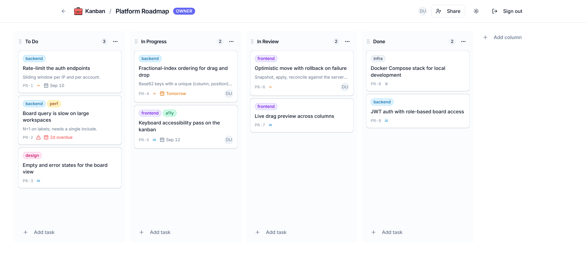

# Mini Kanban Board

A premium Trello-style Kanban board built with NestJS + Prisma + PostgreSQL on the backend and Next.js + shadcn/ui on the frontend.

## Live demo

| | |
| --- | --- |
| **App** | <https://kanban-pink-rho.vercel.app> |
| **API** | <https://kanban-api-vc5x.onrender.com/api> |
| **API health** | <https://kanban-api-vc5x.onrender.com/api/health> |

Register a new account from the app to try it — sign-up is open, and a new account starts with an empty board list.

> **First request may be slow.** The API is on Render's free tier, which suspends the instance after a period of inactivity. The first call can take up to a minute while it wakes up; everything is fast once it is warm. If the first sign-in seems to hang, wait a moment and retry.



## Features

- **Boards, columns, tasks** — full CRUD with role-based permissions (OWNER / EDITOR / VIEWER)
- **Drag-and-drop** — cards *and columns*, with a live preview: the board reorders under the cursor mid-drag, not on drop. Escape restores the pre-drag state
- **Conflict-free ordering** — base62 fractional-index keys with a unique `(column, position)` constraint and bounded retry. Eight concurrent moves to the same slot leave eight distinct positions and a strict total order; there is no renumbering pass and no precision ceiling. See [`fractional-index.ts`](backend/src/common/ordering/fractional-index.ts)
- **Task depth** — per-board labels, due dates with overdue styling, priority, and human-readable keys (`PR-14`) from an atomically-incremented per-board counter
- **Sharing** — invite teammates by email, assign per-board roles
- **Auth** — JWT-based register/login with bcrypt-hashed passwords
- **Dark mode** — every page, every component, with next-themes
- **Optimistic mutations** — the UI updates in the same frame as the interaction, then reconciles against the server's canonical ordering key; failures roll back
- **Accessibility** — full keyboard drag-and-drop (`Space` to lift, arrows to move within a column and across columns, `Space` to drop, `Escape` to cancel), with screen-reader announcements that name the task and its destination column rather than reading raw ids. Plus focus rings and ARIA labels throughout

## Tech Stack

**Backend** — NestJS 10 · Prisma 7 · PostgreSQL 16 · JWT (`@nestjs/jwt`) · bcrypt · `class-validator` · Jest (29 unit + 132 e2e)

**Frontend** — Next.js 14 (App Router) · TypeScript · shadcn/ui · Tailwind CSS · react-hook-form + zod · `@dnd-kit` · Sonner · lucide-react

**Infra** — Docker · docker-compose (prod + dev override) · multi-stage Alpine images

## Quick Start — Docker (recommended)

Clone, configure, run:

```bash
git clone <repo-url> webbriks-kanban
cd webbriks-kanban

cp .env.docker.example .env
# Edit .env — set JWT_SECRET to a random string (32+ bytes)
#   openssl rand -base64 32

npm run up
```

That's it. After ~2 minutes the script prints the URLs it chose, for example:

```
  frontend: 3000 -> 3002  (default is busy)
  postgres: 5432 -> 5434  (default is busy)

  frontend   http://localhost:3002
  API        http://localhost:3001/api
  postgres   localhost:5434
  mode       production (compiled images)
```

Open the frontend, register an account, create a board, add a column, drag a task
around. State persists across `npm run down` / `npm run up` (the `postgres_data`
volume is preserved).

### Why `npm run up` instead of `docker compose up`

Compose can't fall back when a host port is taken — it just fails to bind. That
bites often on a dev machine, where 3000 and 5432 are usually spoken for. And
`NEXT_PUBLIC_API_URL` is inlined into the frontend bundle at *build* time, so the
frontend has to know the backend's port before its image is built; Compose can't
compute that itself (it doesn't resolve a nested `${...}` inside a default, and
falls back to the literal — leaving the frontend calling a backend that isn't
there).

`scripts/up.mjs` probes each port, picks the next free one, and derives
`CORS_ORIGIN` and `NEXT_PUBLIC_API_URL` to match before handing off to Compose.
It probes by *connecting*, not by binding: on Windows a second process can bind a
port another one already holds, so a bind test reports "free" for a port that is
in practice shadowed.

```bash
npm run up                  # pick free ports, build, start detached
npm run up -- --dry-run     # show the ports it would use, start nothing
npm run up -- --attach      # stream logs instead of detaching
npm run up -- --no-build    # skip the image rebuild
npm run up -- --dev         # hot-reload stack (see below)
FRONTEND_PORT=4000 npm run up   # pin a port; it still gets verified
```

To pin ports permanently, uncomment `FRONTEND_PORT` / `BACKEND_PORT` /
`POSTGRES_PORT` in `.env`.

A bare `docker compose up --build` now always resolves to **production** too —
there's a second compose file for hot-reload (below), but it is never
auto-merged, so a plain `docker compose <anything>` can't land on it by
accident.

### Tear down

```bash
npm run down                   # stop containers (data preserved)
docker compose down -v         # stop + delete data
```

### Hot-reload dev mode

`docker-compose.dev.yml` bind-mounts source code and runs `nest start --watch`
/ `next dev` so saves reload instantly. It is a plain compose file, not an
auto-merged override — you have to name it explicitly:

```bash
npm run up -- --dev            # full stack, hot reload (passes both -f flags for you)
# or directly:
docker compose -f docker-compose.yml -f docker-compose.dev.yml up
# Backend rebuilds on .ts changes; frontend hot-reloads on .tsx changes.
```

This file used to be named `docker-compose.override.yml`, which Compose
auto-merges into *every* bare `docker compose` command whether you want it or
not. That auto-merge caused a real outage during development: a plain
`docker compose up -d backend` (no `-f`) silently applied this file's dev
command onto the already-built production image *without rebuilding it* — the
production image has no source and no `tsconfig.json`, so the container
crashed on boot and, with no restart policy at the time, stayed dead. The file
was renamed and the compose services now carry `restart: unless-stopped` so
neither failure mode can happen silently again.

## Quick Start — Local without Docker

For contributors who want hot-reload without any Docker:

```bash
# 1. Postgres (Docker for the db only)
docker run -d --name kanban-postgres \
  -e POSTGRES_USER=kanban \
  -e POSTGRES_PASSWORD=kanban \
  -e POSTGRES_DB=kanban \
  -p 5432:5432 \
  postgres:16-alpine

# 2. Backend
cd backend
cp .env.example .env
# Edit .env: set DATABASE_URL and JWT_SECRET
npm install
npx prisma migrate dev
npm run start:dev

# 3. Frontend (new terminal)
cd frontend
cp .env.example .env
npm install
npm run dev
```

Both apps now run with hot-reload; the frontend proxies API calls to the backend.

## Architecture

### Schema (7 tables)

| Table          | Purpose                                                  |
| -------------- | -------------------------------------------------------- |
| `users`        | Auth (email + bcrypt)                                    |
| `boards`       | Owned by a user; carries a derived `key` (`PR`) and an atomic `taskCounter` for task keys |
| `board_members`| Many-to-many users ↔ boards with a `role` (OWNER/EDITOR/VIEWER) |
| `columns`      | Belongs to a board, ordered by a fractional-index `position` (String) |
| `tasks`        | Belongs to a column, ordered by a fractional-index `position` (String); carries `number` (→ display key `PR-14`), `priority`, `dueDate`, optional assignee |
| `labels`       | Per-board, unique name per board, palette-token `color`  |
| `task_labels`  | Many-to-many tasks ↔ labels                              |

Full schema: [`backend/prisma/schema.prisma`](backend/prisma/schema.prisma).

### API endpoints

```
POST   /api/auth/register            # create account
POST   /api/auth/login               # get JWT
GET    /api/auth/me                  # current user from the JWT

GET    /api/boards                   # list boards the caller is a member of
POST   /api/boards                   # create board (caller becomes OWNER)
GET    /api/boards/:id               # full board (columns + tasks + members + labels)
PATCH  /api/boards/:id               # rename / describe
DELETE /api/boards/:id               # OWNER only

POST   /api/boards/:id/share          # OWNER invites a user (by email)
DELETE /api/boards/:id/share/:userId    # OWNER removes a member

GET    /api/boards/:boardId/labels   # list a board's labels
POST   /api/boards/:boardId/labels   # create a label (EDITOR+)
PATCH  /api/labels/:id               # rename / recolor (EDITOR+ on the owning board)
DELETE /api/labels/:id               # delete (EDITOR+; detaches from tasks, doesn't delete them)

POST   /api/columns                  # create column (appends; position is server-assigned)
PATCH  /api/columns/:id              # rename
PUT    /api/columns/reorder          # reorder all of a board's columns by index
DELETE /api/columns/:id              # delete (last column → 400)

POST   /api/tasks                    # create task (title, description, assigneeId, priority, dueDate, labelIds)
GET    /api/tasks/:id                # get one task
PATCH  /api/tasks/:id                # edit any of the above; labelIds replaces the set wholesale
DELETE /api/tasks/:id                # delete task
PATCH  /api/tasks/:id/move           # move across/within columns, conflict-free under concurrency

GET    /api/users/lookup?email=…     # resolve email to userId (for share)

GET    /api/health                   # liveness probe (no auth)
```

### Conflict-free ordering (fractional indexing)

`position` on `columns` and `tasks` is a base62 string, ordered lexicographically — not a float. Moving a task computes a key strictly between its new neighbours (`generateKeyBetween`), so there's always a representable value between any two distinct keys and no epsilon-triggered renumbering pass, ever. A unique `(column, position)` index is the backstop for the one case the algorithm alone can't prevent: two concurrent movers reading the same neighbours and computing the same key. The loser's write fails on the constraint and retries with jittered backoff against the now-current order. Verified: 8 concurrent moves to the same slot leave 8 distinct positions and a strict total order — the original float implementation collapsed 7 of 8 onto a single value under the same test. See [`fractional-index.ts`](backend/src/common/ordering/fractional-index.ts) and [`ordering-retry.ts`](backend/src/common/ordering/ordering-retry.ts).

## Environment Variables

### Backend (`backend/.env`)

| Variable          | Required | Default                     | Description                              |
| ----------------- | -------- | -------------------------- | ---------------------------------------- |
| `DATABASE_URL`    | ✅       | —                          | Postgres connection string              |
| `JWT_SECRET`      | ✅       | —                          | Signing secret. **Generate per env.**   |
| `JWT_EXPIRES_IN`  |          | `24h`                      | Token lifetime                          |
| `CORS_ORIGIN`     |          | `http://localhost:3000`    | Frontend URL (comma-separated for multi)|
| `PORT`            |          | `3001`                     | API port                                |
| `NODE_ENV`        |          | `development`              | `production` in Docker / deploy         |

### Frontend (`frontend/.env.local`)

| Variable              | Required | Default                      | Description                                          |
| --------------------- | -------- | ---------------------------- | ---------------------------------------------------- |
| `NEXT_PUBLIC_API_URL` | ✅       | `http://localhost:3001/api` | API base URL. **Inlined at build time** — changes require rebuild. |

### Docker (`.env` at repo root)

| Variable              | Default                      | Notes                                                |
| --------------------- | ---------------------------- | ---------------------------------------------------- |
| `JWT_SECRET`          | `dev-secret-change-me`       | **Change this in production**                        |
| `JWT_EXPIRES_IN`      | `24h`                        |                                                      |
| `CORS_ORIGIN`         | `http://localhost:3000`      | Match your frontend URL                              |
| `NEXT_PUBLIC_API_URL` | `http://localhost:3001/api`  | Used at frontend Docker build                        |

## Scripts

### Root (npm-run-all)
```bash
npm run dev          # backend + frontend in parallel (no Docker)
npm run build        # both
npm run lint         # both
npm run typecheck    # frontend only
npm run test         # backend unit tests
npm run test:e2e     # backend e2e tests (132 specs across 7 suites)
```

### Backend (`backend/`)
```bash
npm run start:dev    # watch mode
npm run build        # compile
npm run start:prod   # run compiled
npm run prisma:generate
npm run prisma:migrate   # dev migration (interactive)
npm run prisma:deploy    # prod migration (CI-safe)
npm run prisma:studio    # DB GUI
```

### Frontend (`frontend/`)
```bash
npm run dev          # HMR
npm run build        # production
npm run start        # run production build
npm run lint
npm run typecheck
```

## Project Structure

```
.
├── backend/                # NestJS API
│   ├── prisma/            # Schema + migrations
│   ├── src/
│   │   ├── auth/          # JWT register/login
│   │   ├── boards/        # Board CRUD + sharing
│   │   ├── columns/       # Column CRUD
│   │   ├── tasks/         # Task CRUD + movement
│   │   ├── users/         # Email lookup (share-by-email)
│   │   ├── health/        # /api/health endpoint
│   │   ├── prisma/        # Prisma service
│   │   └── common/        # Filters, guards, decorators
│   ├── test/              # Jest e2e tests
│   └── Dockerfile
├── frontend/              # Next.js UI
│   ├── src/
│   │   ├── app/           # App Router routes
│   │   ├── components/    # shadcn/ui + kanban components
│   │   ├── contexts/      # Auth context
│   │   ├── hooks/         # useBoardData, etc.
│   │   └── lib/           # API client, types, utils
│   └── Dockerfile
├── specs/                 # Work specifications (01–12)
├── docs/
│   └── iteration-log.md   # Build log
├── DESIGN.md              # UI design contract
├── AGENTS.md              # Agent behavior rules
├── docker-compose.yml     # Prod stack (this is what a bare `docker compose up` runs)
├── docker-compose.dev.yml # Dev stack, hot reload — must be named explicitly, never auto-merged
├── scripts/up.mjs         # Picks free ports, derives CORS/API URL, then runs one of the above
└── README.md
```

## Documentation

- **[`DESIGN.md`](DESIGN.md)** — UI design contract (typography, colors, motion, density rules)
- **[`AGENTS.md`](AGENTS.md)** — Repo conventions for AI agents
- **[`specs/`](specs/)** — Full work specifications (12 of them, one per major iteration)
- **[`docs/iteration-log.md`](docs/iteration-log.md)** — Chronological build log with decisions

## License

MIT