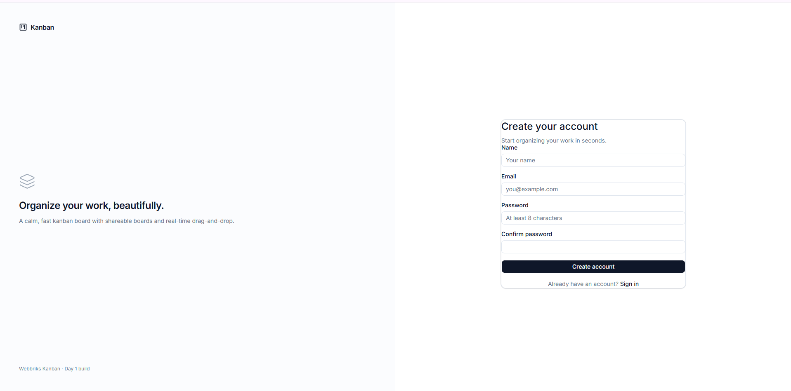

# Mini Kanban Board

A premium Trello-style Kanban board built with NestJS + Prisma + PostgreSQL on the backend and Next.js + shadcn/ui on the frontend.



## Features

- **Boards, columns, tasks** — full CRUD with role-based permissions (OWNER / EDITOR / VIEWER)
- **Drag-and-drop** — cards *and columns*, with a live preview: the board reorders under the cursor mid-drag, not on drop. Escape restores the pre-drag state
- **Conflict-free ordering** — base62 fractional-index keys with a unique `(column, position)` constraint and bounded retry. Eight concurrent moves to the same slot leave eight distinct positions and a strict total order; there is no renumbering pass and no precision ceiling. See [`fractional-index.ts`](backend/src/common/ordering/fractional-index.ts)
- **Task depth** — per-board labels, due dates with overdue styling, priority, and human-readable keys (`PR-14`) from an atomically-incremented per-board counter
- **Sharing** — invite teammates by email, assign per-board roles
- **Auth** — JWT-based register/login with bcrypt-hashed passwords
- **Dark mode** — every page, every component, with next-themes
- **Optimistic mutations** — the UI updates in the same frame as the interaction, then reconciles against the server's canonical ordering key; failures roll back
- **Accessibility** — keyboard-navigable drag-drop, focus rings, ARIA labels

## Tech Stack

**Backend** — NestJS 10 · Prisma 7 · PostgreSQL 16 · JWT (`@nestjs/jwt`) · bcrypt · `class-validator` · Jest (29 unit + 132 e2e)

**Frontend** — Next.js 14 (App Router) · TypeScript · shadcn/ui · Tailwind CSS · react-hook-form + zod · `@dnd-kit` · Sonner · lucide-react

**Infra** — Docker · docker-compose (prod + dev override) · multi-stage Alpine images

## Quick Start — Docker (recommended)

Clone, configure, run:

```bash
git clone <repo-url> webbriks-kanban
cd webbriks-kanban

cp .env.docker.example .env
# Edit .env — set JWT_SECRET to a random string (32+ bytes)
#   openssl rand -base64 32

npm run up
```

That's it. After ~2 minutes the script prints the URLs it chose, for example:

```
  frontend: 3000 -> 3002  (default is busy)
  postgres: 5432 -> 5434  (default is busy)

  frontend   http://localhost:3002
  API        http://localhost:3001/api
  postgres   localhost:5434
  mode       production (compiled images)
```

Open the frontend, register an account, create a board, add a column, drag a task
around. State persists across `npm run down` / `npm run up` (the `postgres_data`
volume is preserved).

### Why `npm run up` instead of `docker compose up`

Compose can't fall back when a host port is taken — it just fails to bind. That
bites often on a dev machine, where 3000 and 5432 are usually spoken for. And
`NEXT_PUBLIC_API_URL` is inlined into the frontend bundle at *build* time, so the
frontend has to know the backend's port before its image is built; Compose can't
compute that itself (it doesn't resolve a nested `${...}` inside a default, and
falls back to the literal — leaving the frontend calling a backend that isn't
there).

`scripts/up.mjs` probes each port, picks the next free one, and derives
`CORS_ORIGIN` and `NEXT_PUBLIC_API_URL` to match before handing off to Compose.
It probes by *connecting*, not by binding: on Windows a second process can bind a
port another one already holds, so a bind test reports "free" for a port that is
in practice shadowed.

```bash
npm run up                  # pick free ports, build, start detached
npm run up -- --dry-run     # show the ports it would use, start nothing
npm run up -- --attach      # stream logs instead of detaching
npm run up -- --no-build    # skip the image rebuild
npm run up -- --dev         # hot-reload stack (see below)
FRONTEND_PORT=4000 npm run up   # pin a port; it still gets verified
```

To pin ports permanently, uncomment `FRONTEND_PORT` / `BACKEND_PORT` /
`POSTGRES_PORT` in `.env`.

Plain `docker compose up --build` still works if all three default ports are free
— but note it auto-merges `docker-compose.override.yml` and therefore runs the
**development** stack. `npm run up` passes `-f docker-compose.yml` explicitly so
you get the production images the multi-stage Dockerfiles build.

### Tear down

```bash
npm run down                   # stop containers (data preserved)
docker compose down -v         # stop + delete data
```

### Hot-reload dev mode

`docker-compose.override.yml` bind-mounts source code and runs
`nest start --watch` / `next dev` so saves reload instantly:

```bash
docker compose up              # full stack, hot reload
# Backend rebuilds on .ts changes; frontend hot-reloads on .tsx changes.
```

## Quick Start — Local without Docker

For contributors who want hot-reload without any Docker:

```bash
# 1. Postgres (Docker for the db only)
docker run -d --name kanban-postgres \
  -e POSTGRES_USER=kanban \
  -e POSTGRES_PASSWORD=kanban \
  -e POSTGRES_DB=kanban \
  -p 5432:5432 \
  postgres:16-alpine

# 2. Backend
cd backend
cp .env.example .env
# Edit .env: set DATABASE_URL and JWT_SECRET
npm install
npx prisma migrate dev
npm run start:dev

# 3. Frontend (new terminal)
cd frontend
cp .env.example .env
npm install
npm run dev
```

Both apps now run with hot-reload; the frontend proxies API calls to the backend.

## Architecture

### Schema (5 tables)

| Table          | Purpose                                                  |
| -------------- | -------------------------------------------------------- |
| `users`        | Auth (email + bcrypt)                                    |
| `boards`       | Owned by a user, has many columns                        |
| `board_members`| Many-to-many users ↔ boards with a `role` (OWNER/EDITOR/VIEWER) |
| `columns`      | Belongs to a board, has a fractional `position`          |
| `tasks`        | Belongs to a column, has a fractional `position`, optional assignee |

Full schema: [`backend/prisma/schema.prisma`](backend/prisma/schema.prisma).

### API endpoints

```
POST   /api/auth/register          # create account
POST   /api/auth/login             # get JWT

GET    /api/boards                 # list boards the caller is a member of
POST   /api/boards                 # create board (caller becomes OWNER)
GET    /api/boards/:id             # full board (columns + tasks + members)
PATCH  /api/boards/:id             # rename / describe
DELETE /api/boards/:id             # OWNER only

POST   /api/boards/:id/share        # OWNER invites a user (by email)
DELETE /api/boards/:id/share/:userId  # OWNER removes a member

POST   /api/columns                # create column
PATCH  /api/columns/:id            # rename
DELETE /api/columns/:id            # delete (last column → 400)

POST   /api/tasks                  # create task
PATCH  /api/tasks/:id              # edit title/description/assignee
DELETE /api/tasks/:id              # delete task
PATCH  /api/tasks/:id/move         # move across/within columns

GET    /api/users/lookup?email=…   # resolve email to userId (for share)

GET    /api/health                 # liveness probe (no auth)
```

### Fractional indexing for task ordering

Each task has a `Float position` column. To move a task between two siblings, the server computes `(prev.position + next.position) / 2` — no renumbering, no lock contention. If the gap shrinks below an epsilon, the entire column is renumbered (`rebalance`). This is what makes drag-and-drop conflict-free and allows multiple users to reorder simultaneously without lost writes.

## Environment Variables

### Backend (`backend/.env`)

| Variable          | Required | Default                     | Description                              |
| ----------------- | -------- | -------------------------- | ---------------------------------------- |
| `DATABASE_URL`    | ✅       | —                          | Postgres connection string              |
| `JWT_SECRET`      | ✅       | —                          | Signing secret. **Generate per env.**   |
| `JWT_EXPIRES_IN`  |          | `24h`                      | Token lifetime                          |
| `CORS_ORIGIN`     |          | `http://localhost:3000`    | Frontend URL (comma-separated for multi)|
| `PORT`            |          | `3001`                     | API port                                |
| `NODE_ENV`        |          | `development`              | `production` in Docker / deploy         |

### Frontend (`frontend/.env.local`)

| Variable              | Required | Default                      | Description                                          |
| --------------------- | -------- | ---------------------------- | ---------------------------------------------------- |
| `NEXT_PUBLIC_API_URL` | ✅       | `http://localhost:3001/api` | API base URL. **Inlined at build time** — changes require rebuild. |

### Docker (`.env` at repo root)

| Variable              | Default                      | Notes                                                |
| --------------------- | ---------------------------- | ---------------------------------------------------- |
| `JWT_SECRET`          | `dev-secret-change-me`       | **Change this in production**                        |
| `JWT_EXPIRES_IN`      | `24h`                        |                                                      |
| `CORS_ORIGIN`         | `http://localhost:3000`      | Match your frontend URL                              |
| `NEXT_PUBLIC_API_URL` | `http://localhost:3001/api`  | Used at frontend Docker build                        |

## Scripts

### Root (npm-run-all)
```bash
npm run dev          # backend + frontend in parallel (no Docker)
npm run build        # both
npm run lint         # both
npm run typecheck    # frontend only
npm run test         # backend unit tests
npm run test:e2e     # backend e2e tests (108 specs)
```

### Backend (`backend/`)
```bash
npm run start:dev    # watch mode
npm run build        # compile
npm run start:prod   # run compiled
npm run prisma:generate
npm run prisma:migrate   # dev migration (interactive)
npm run prisma:deploy    # prod migration (CI-safe)
npm run prisma:studio    # DB GUI
```

### Frontend (`frontend/`)
```bash
npm run dev          # HMR
npm run build        # production
npm run start        # run production build
npm run lint
npm run typecheck
```

## Project Structure

```
.
├── backend/                # NestJS API
│   ├── prisma/            # Schema + migrations
│   ├── src/
│   │   ├── auth/          # JWT register/login
│   │   ├── boards/        # Board CRUD + sharing
│   │   ├── columns/       # Column CRUD
│   │   ├── tasks/         # Task CRUD + movement
│   │   ├── users/         # Email lookup (share-by-email)
│   │   ├── health/        # /api/health endpoint
│   │   ├── prisma/        # Prisma service
│   │   └── common/        # Filters, guards, decorators
│   ├── test/              # Jest e2e tests
│   └── Dockerfile
├── frontend/              # Next.js UI
│   ├── src/
│   │   ├── app/           # App Router routes
│   │   ├── components/    # shadcn/ui + kanban components
│   │   ├── contexts/      # Auth context
│   │   ├── hooks/         # useBoardData, etc.
│   │   └── lib/           # API client, types, utils
│   └── Dockerfile
├── specs/                 # Work specifications (01–12)
├── docs/
│   └── iteration-log.md   # Build log
├── DESIGN.md              # UI design contract
├── AGENTS.md              # Agent behavior rules
├── docker-compose.yml     # Prod stack
├── docker-compose.override.yml  # Dev (hot reload)
└── README.md
```

## Documentation

- **[`DESIGN.md`](DESIGN.md)** — UI design contract (typography, colors, motion, density rules)
- **[`AGENTS.md`](AGENTS.md)** — Repo conventions for AI agents
- **[`specs/`](specs/)** — Full work specifications (12 of them, one per major iteration)
- **[`docs/iteration-log.md`](docs/iteration-log.md)** — Chronological build log with decisions

## License

MIT